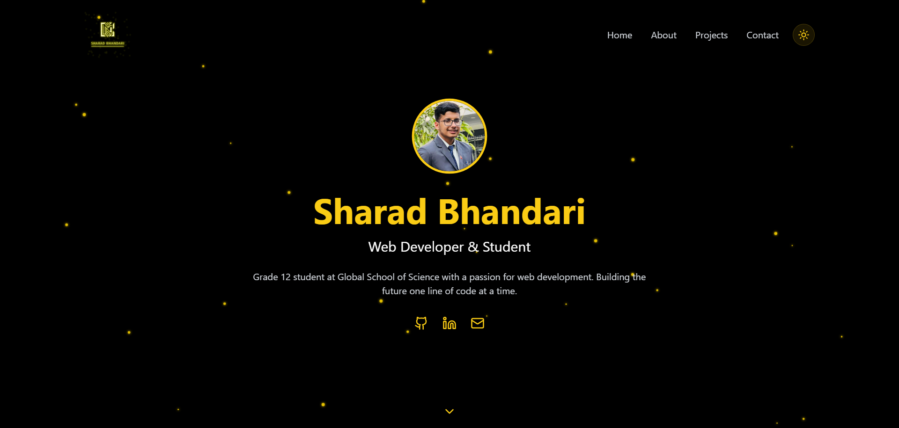

# Personal Portfolio Website



Welcome to my personal portfolio website! This project showcases my skills and projects as a web developer and student. Built with modern web technologies, the portfolio features smooth animations, interactive elements, and a responsive design.

## 🚀 Features

- **Dynamic Animations:** Smooth transitions and animations powered by GSAP and Particle.js.
- **3D Elements:** Stunning visuals using Three.js.
- **Responsive Design:** Optimized for desktop and mobile viewing with Tailwind CSS.
- **Modern Technologies:** Developed with React (TypeScript), Tailwind CSS, and other libraries.
- **Social Links:** Easy access to my GitHub, LinkedIn, and email.

## 🛠️ Technologies Used

- **React (TypeScript):** For building the interactive UI.
- **Tailwind CSS:** For rapid and responsive styling.
- **Font Awesome & Lucide:** For icons and visuals.
- **GSAP & Particle.js:** For animations.
- **Three.js:** For 3D elements and visual effects.

## 📂 Directory Structure

Here’s an overview of the project structure:

```plaintext
├── src
├── .gitignore
├── eslint.config.js
├── index.html
├── package-lock.json
├── package.json
├── postcss.config.js
├── tailwind.config.js
├── tsconfig.app.json
├── tsconfig.json
├── tsconfig.node.json
└── vite.config.ts
```

## 🚀 Getting Started

Follow these steps to run the project locally:

### Prerequisites

Ensure you have the following installed:

- **Node.js:** Download and install from [Node.js](https://nodejs.org).
- **Package Manager:** NPM (comes with Node.js) or Yarn.

### Installation

1. Clone the repository:
   ```bash
   git clone https://github.com/your-username/portfolio-website.git
   ```

2. Navigate to the project directory:
   ```bash
   cd portfolio-website
   ```

3. Install dependencies:
   ```bash
   npm install
   ```

### Running the Project

1. Start the development server:
   ```bash
   npm run dev
   ```

2. Open your browser and go to `http://localhost:3000`.

### Building for Production

To build the project for production:
```bash
npm run build
```
The production files will be located in the `dist` directory.

## 📬 Contact

Feel free to reach out to me for collaboration or questions:

- **GitHub:** [SharadS28N](https://github.com/SharadS28N)
- **LinkedIn:** [Sharad Bhandari](https://www.linkedin.com/in/sharadb2/)